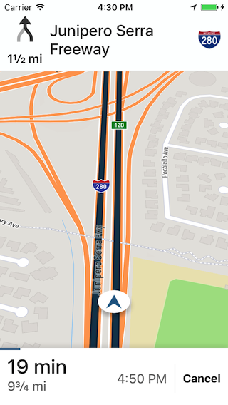

# Mapbox Navigation SDK for iOS

[](https://www.bitrise.io/app/2f82077d3f083479)
[](https://github.com/Carthage/Carthage)
[](http://cocoadocs.org/docsets/MapboxNavigation/)



Mapbox Navigation gives you all the tools you need to add turn-by-turn navigation to your apps.

Get up and running in a few minutes with our drop-in turn-by-turn navigation `RouteViewController`, or build a completely custom turn-by-turn navigation app with our core components for routing and navigation.

## Features

- Drop-in turn-by-turn navigation UI
- Automotive, cycling, and walking directions
- Traffic avoidance
- Maneuver announcements
- Text instructions
- Text to speech support via AVSpeechSynthesizer or Amazon Polly
- Automatic rerouting
- Snap to route

## Installation

To install Mapbox Navigation using [Carthage](https://github.com/Carthage/Carthage/) v0.19.0 or above:

1. Specify the following dependency in your Cartfile:
   ```cartfile
   github "mapbox/mapbox-navigation-ios" ~> 0.3.0
   ```

1. Run `carthage update --platform iOS` to build just the iOS dependencies.

1. Follow the rest of [Carthage’s iOS integration instructions](https://github.com/Carthage/Carthage#if-youre-building-for-ios-tvos-or-watchos). Your application target’s Embedded Frameworks should include MapboxNavigation.framework and MapboxCoreNavigation.framework.

Alternatively, to install Mapbox Navigation using [CocoaPods](https://cocoapods.org/):

1. Specify the following dependency in your Podfile:
   ```ruby
   pod 'MapboxNavigation', '~> 0.3.0'
   ```

1. Run `pod install` and open the resulting Xcode workspace.

### Running the example project

1. Clone the repository or download the [.zip file](https://github.com/mapbox/mapbox-navigation-ios/archive/master.zip)
1. Run `carthage update --platform ios` to build just the iOS dependencies
1. Open `MapboxNavigation.xcodeproj`
1. Sign up or log in to your Mapbox account and grab a [Mapbox Access Token](https://www.mapbox.com/studio/account/tokens/)
1. Open the `Info.plist` for either `Example-Swift` or `Example-Objective-C` and paste your [Mapbox Access Token](https://www.mapbox.com/studio/account/tokens/) into `MGLMapboxAccessToken`
1. Build and run the `Example-Swift` or `Example-Objective-C` target

## Usage

```swift
import MapboxDirections
import MapboxNavigation
```

```swift
let origin = Waypoint(coordinate: CLLocationCoordinate2D(latitude: 38.9131752, longitude: -77.0324047), name: "Mapbox")
let destination = Waypoint(coordinate: CLLocationCoordinate2D(latitude: 38.8977, longitude: -77.0365), name: "White House")

let options = RouteOptions(waypoints: [origin, destination], profileIdentifier: .automobileAvoidingTraffic)
options.routeShapeResolution = .full
options.includesSteps = true

Directions.shared.calculate(options) { (waypoints, routes, error) in
    guard let route = routes?.first else { return }

    let viewController = NavigationViewController(for: route)
    self.present(viewController, animated: true, completion: nil)
}
```

#### Required Info.plist Keys
Mapbox Navigation requires a few additions to your `Info.plist`. Be sure to sign up or log in to your Mapbox account and grab a [Mapbox Access Token](https://www.mapbox.com/studio/account/tokens/).

1. Add a `MGLMapboxAccessToken` key and paste your [Mapbox Access Token](https://www.mapbox.com/studio/account/tokens/)
1. Add a `NSLocationWhenInUseUsageDescription` key if you haven't already
1. If you need voice guidance while your app is in the background, you'll also need to add the `audio` and `location` value to the `UIBackgroundModes` array. You can also do this by navigating to the `Capabilities` tab -> `Background Modes` and enabling the following:
    - `Audio, AirPlay, and Picture in Picture`
    - `Location updates`

#### Storyboards
See [this guide](https://github.com/mapbox/mapbox-navigation-ios/blob/master/Docs/Storyboards.md) for usage with storyboards.

### UI overrides and listeners

#### Colors

You can override the default colors in the UI.

```swift
// Used for guidance arrow, highlighted text and progress bars.
NavigationUI.shared.tintColor = .red

// Used for guidance arrow
NavigationUI.shared.tintStrokeColor = .blue

// Used for titles and prioritized information
NavigationUI.shared.primaryTextColor = .orange

// Used for subtitles, distances and accessory labels
NavigationUI.shared.secondaryTextColor = .pink

// Used for separators in table views
NavigationUI.shared.lineColor = .yellow
```

#### RouteViewController Delegate Methods

* `routeControllerDidCancelNavigation`: Fired when the user taps `Cancel`. You are responsible for dismissing the UI

## Building your own custom navigation UI

Mapbox Navigation gives you all the components you need, should you want to build your own custom turn-by-turn navigation UI:

* [Mapbox Maps SDK](https://www.mapbox.com/ios-sdk/)
* [Mapbox Studio](https://www.mapbox.com/studio/)
  * Design custom maps with live traffic overlays
* [MapboxDirections](https://github.com/mapbox/MapboxDirections.swift)
  * Automotive, cycling, and walking directions
  * Traffic-influenced driving directions
* Mapbox Core Navigation (`MapboxCoreNavigation` module)
  * Route controller
    * Progress calculations
    * Location snapping
  * Guidance notifications
    * Current progress along a route
    * Departure and arrival notifications
    * Upcoming maneuver notifications
    * Rerouting notifications
  * Geometry functions
  * Distance formatter

### Installing Mapbox Core Navigation

[](https://github.com/Carthage/Carthage)
[](http://cocoadocs.org/docsets/MapboxCoreNavigation/)

To install Mapbox Core Navigation using [Carthage](https://github.com/Carthage/Carthage/) v0.19.0 or above:

1. Specify the following dependency in your Cartfile:
   ```cartfile
   github "mapbox/mapbox-navigation-ios" ~> 0.3.0
   ```

1. Run `carthage update --platform iOS` to build just the iOS dependencies.

1. Follow the rest of [Carthage’s iOS integration instructions](https://github.com/Carthage/Carthage#if-youre-building-for-ios-tvos-or-watchos). Your application target’s Embedded Frameworks should include MapboxCoreNavigation.framework.

Alternatively, to install Mapbox Core Navigation using [CocoaPods](https://cocoapods.org/):

1. Specify the following dependency in your Podfile:
   ```ruby
   pod 'MapboxCoreNavigation', '~> 0.3.0'
   ```

1. Run `pod install` and open the resulting Xcode workspace.

### Route Controller

`RouteController` is given a route. Internally `RouteController` matches the user's current location to the route while looking at 3 principle pieces:

1. Is the user on or off the route?
1. How far along the step is the user?
1. Does the user need to be alerted about an upcoming maneuver?

The library compares the user from the route and decides upon each one of these parameters and acts accordingly. The developer is told what is happening behind the scenes via `NSNotification`.

### Guidance Notifications

This library relies heavily on `NSNotification`s for letting the developer know when events have occurred.

#### `RouteControllerProgressDidChange`

* Emitted when the user moves along the route. Notification contains 3 keys:
  * `RouteControllerProgressDidChangeNotificationProgressKey` - `RouteProgress` - Current progress along route
  * `RouteControllerProgressDidChangeNotificationLocationKey` - `CLLocation` - Current location
  * `RouteControllerProgressDidChangeNotificationSecondsRemainingOnStepKey` - `Double` - Given users speed and location, this is the number of seconds left to the end of the step

#### `RouteControllerAlertLevelDidChange`

* Emitted when the alert level changes. This indicates the user should be notified about the upcoming maneuver. See [Alerts](#Alert levels). Notification contains 3 keys:
  * `RouteControllerProgressDidChangeNotificationProgressKey` - `RouteProgress` - Current progress along route
  * `RouteControllerAlertLevelDidChangeNotificationDistanceToEndOfManeuverKey` - `CLLocationDistance` - The users snapped distance to the end of the route.

#### `RouteControllerShouldReroute`

* Emitted when the user is off the route and should be rerouted. Notification contains 1 key:
  * `RouteControllerNotificationShouldRerouteKey` - `CLLocation` - Last location of user

### Alert levels

Alert levels indicate the type of announcement that should be given. The enum types available are:

* `none`
* `depart` - Emitted while departing origin
* `low` - Emitted directly after completing the maneuver
* `medium` - Emitted when the user has [70 seconds](https://github.com/mapbox/mapbox-navigation-ios/blob/19365cdad5f18641579a560dfc7113057b3053ad/MapboxNavigation/Constants.swift#L15) remaining on the route.
* `high` - Emitted when the user has [15 seconds](https://github.com/mapbox/mapbox-navigation-ios/blob/19365cdad5f18641579a560dfc7113057b3053ad/MapboxNavigation/Constants.swift#L16) remaining on the route.
* `arrive` - Emitted when the user arrives at destination

### Rerouting

In the event of a reroute, it's necessary to update the current route with a new route. Once fetched, you can update the current route by:

```swift
navigation.routeProgress = RouteProgress(route: newRoute)
```

## License

Mapbox Navigation SDK for iOS is released under the ISC License. [See LICENSE](https://github.com/mapbox/mapbox-navigation-ios/blob/master/LICENSE.md) for details.
