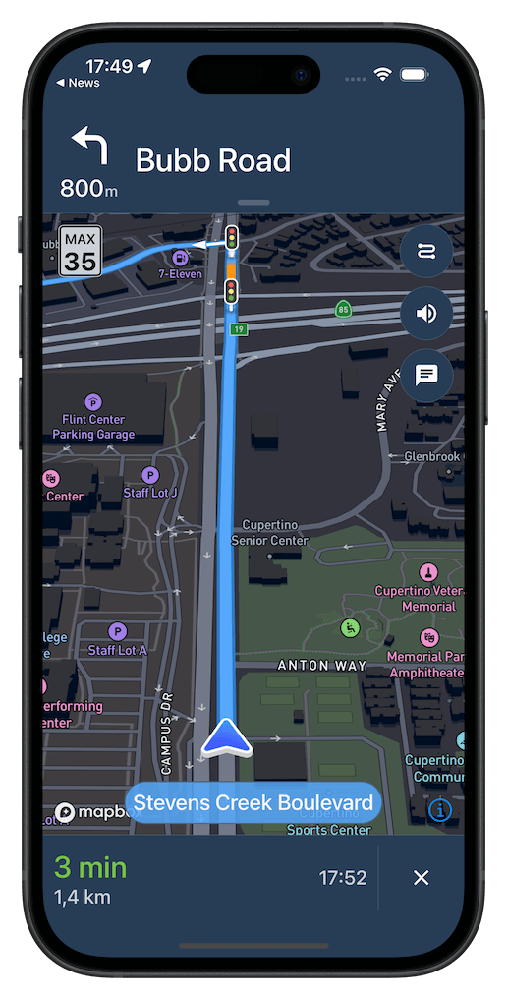

# [Mapbox Navigation SDK for iOS](https://docs.mapbox.com/ios/navigation/)

[](https://swift.org/package-manager/)



Mapbox Navigation gives you all the tools you need to add turn-by-turn navigation to your iOS application.

Get up and running in a few minutes with our drop-in turn-by-turn navigation `NavigationViewController`, or build a completely custom turn-by-turn navigation app with our core components for routing and navigation.

### Features

* A full-fledged turn-by-turn navigation UI for iPhone, iPad, and CarPlay that’s ready to drop into your application
* [Professionally designed map styles](https://www.mapbox.com/maps/) for daytime and nighttime driving
* Worldwide driving, cycling, and walking directions powered by [open data](https://www.mapbox.com/about/maps/) and user feedback
* Traffic avoidance and proactive rerouting based on current conditions in [over 55 countries](https://docs.mapbox.com/help/how-mapbox-works/directions/#traffic-data)
* Natural-sounding turn instructions
* Support for over two dozen languages

### [Documentation](https://docs.mapbox.com/ios/navigation/api-reference/)

## Requirements

The Mapbox Navigation SDK and Core Navigation are compatible with applications written in Swift 5.9 in Xcode 15.0 and above. The Mapbox Navigation and Mapbox Core Navigation frameworks run on iOS 14.0 and above.

The Mapbox Navigation SDK is also available [for Android](https://github.com/mapbox/mapbox-navigation-android/).

## Installation

### Private token configuration

To install the SDK in an application using [Swift Package Manager](https://swift.org/package-manager/):

1. Go to your [Mapbox account dashboard](https://account.mapbox.com/) and create an access token that has the `DOWNLOADS:READ` scope. **PLEASE NOTE: This is not the same as your production Mapbox API token. Make sure to keep it private and do not insert it into any Info.plist file.** Create a file named `.netrc` in your home directory if it doesn’t already exist, then add the following lines to the end of the file:
   ```
   machine api.mapbox.com
     login mapbox
     password PRIVATE_MAPBOX_API_TOKEN
   ```
   where _PRIVATE_MAPBOX_API_TOKEN_ is your Mapbox API token with the `DOWNLOADS:READ` scope.

### Using Swift Package Manager

1. In Xcode, go to File ‣ Swift Packages ‣ Add Package Dependency.

1. Enter `https://github.com/mapbox/mapbox-navigation-ios.git` as the package repository and click Next.

1. Set Rules to Version, Up to Next Major, and enter `3.1.0` as the minimum version requirement. Click Next.

To install the MapboxNavigation framework in another package rather than an application, run `swift package init` to create a Package.swift, then add the following dependency:

```swift
// Latest stable release
.package(url: "https://github.com/mapbox/mapbox-navigation-ios.git", from: "3.1.0")
```

### Project configuration

1. Mapbox APIs and vector tiles require a Mapbox account and API access token. In the project editor, select the application target, then go to the Info tab. Under the “Custom iOS Target Properties” section, set `MBXAccessToken` to your access token. You can obtain an access token from the [Mapbox account page](https://account.mapbox.com/access-tokens/).

1. In order for the SDK to track the user’s location as they move along the route, set `NSLocationWhenInUseUsageDescription` to:
   > Shows your location on the map and helps improve the map.

1. Users expect the SDK to continue to track the user’s location and deliver audible instructions even while a different application is visible or the device is locked. Go to the Signing & Capabilities tab. Under the Background Modes section, enable “Audio, AirPlay, and Picture in Picture” and “Location updates”. (Alternatively, add the `audio` and `location` values to the `UIBackgroundModes` array in the Info tab.)

Now import the relevant modules and present a new `NavigationViewController`. You can also push to a navigation view controller from within a storyboard if your application’s UI is laid out in Interface Builder.

## Examples

This repository contains [a testbed application](./Examples) that exercises a variety of navigation SDK features. Configure [Private](#privat-token-configuration) and [Public](#using-swift-package-manager) tokens to run this application.

```swift
import MapboxDirections
import MapboxNavigationCore
import MapboxNavigationUIKit
import UIKit
import CoreLocation
```

```swift
// Define the Mapbox Navigation entry point.
let mapboxNavigationProvider = MapboxNavigationProvider(coreConfig: .init())
lazy var mapboxNavigation = mapboxNavigationProvider.mapboxNavigation
```

```swift
// Define two waypoints to travel between
let origin = Waypoint(coordinate: CLLocationCoordinate2D(latitude: 38.9131752, longitude: -77.0324047), name: "Mapbox")
let destination = Waypoint(coordinate: CLLocationCoordinate2D(latitude: 38.8977, longitude: -77.0365), name: "White House")

// Set options
let options = NavigationRouteOptions(waypoints: [origin, destination])

// Request a route using RoutingProvider
let request = mapboxNavigation.routingProvider().calculateRoutes(options: options)   
Task {
    switch await request.result {
    case .failure(let error):
        print(error.localizedDescription)
    case .success(let navigationRoutes):
        // Pass the generated navigation routes to the the NavigationViewController
        let navigationOptions = NavigationOptions(mapboxNavigation: mapboxNavigation,
                                                  voiceController: mapboxNavigationProvider.routeVoiceController,
                                                  eventsManager: mapboxNavigationProvider.eventsManager())
        let navigationViewController = NavigationViewController(navigationRoutes: navigationRoutes,
                                                                navigationOptions: navigationOptions)
        navigationViewController.modalPresentationStyle = .fullScreen

        present(navigationViewController, animated: true, completion: nil)
    }
}
```

Consult the [API reference](https://docs.mapbox.com/ios/navigation/v3/api-reference/) for further details.

## Customization

### Styling

You can customize the appearance in order to blend in with the rest of your app.

```swift
class CustomStandardDayStyle: StandardDayStyle {
    required init() {
        super.init()
        mapStyleURL = URL(string: "mapbox://styles/mapbox/satellite-streets-v9")!
        styleType = .night
    }

    override func apply() {
        super.apply()
        BottomBannerView.appearance(for: UITraitCollection(userInterfaceIdiom: .phone)).backgroundColor = .orange
        BottomBannerView.appearance(for: UITraitCollection(userInterfaceIdiom: .pad)).backgroundColor = .orange
    }
}
```

then initialize `NavigationViewController` with your style or styles:

```swift
let navigationOptions = NavigationOptions(
            mapboxNavigation: navigationProvider.mapboxNavigation,
            voiceController: navigationProvider.routeVoiceController,
            eventsManager: navigationProvider.eventsManager(),
            styles: [CustomStandardDayStyle()]
        )
NavigationViewController(navigationRoutes: navigationRoutes, navigationOptions: navigationOptions)
```

## License

The Mapbox Navigation SDK for iOS is released under the Mapbox Terms of Service. See [LICENSE.md](./LICENSE.md) for details.
