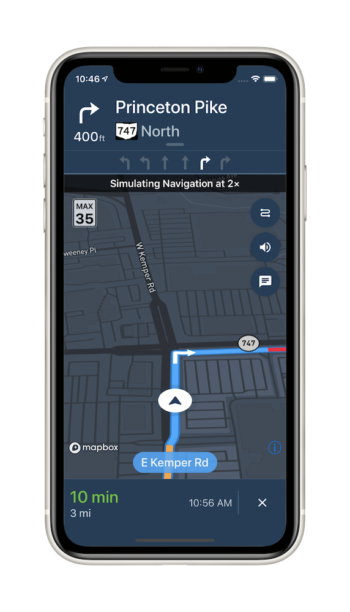

# [Mapbox Navigation SDK for iOS](https://www.mapbox.com/ios-sdk/navigation/)

[](https://circleci.com/gh/mapbox/mapbox-navigation-ios)
[](https://www.bitrise.io/app/6fc45a7e2817b859)
[](https://github.com/Carthage/Carthage)
[](https://cocoapods.org/pods/MapboxNavigation/)



Mapbox Navigation gives you all the tools you need to add turn-by-turn navigation to your application.

Get up and running in a few minutes with our drop-in turn-by-turn navigation `NavigationViewController`, or build a completely custom turn-by-turn navigation app with our core components for routing and navigation.

## Features

* A full-fledged turn-by-turn navigation UI ready to drop into your application
* [Professionally designed map styles](https://www.mapbox.com/maps/) for daytime and nighttime driving
* Worldwide driving, cycling, and walking directions powered by [open data](https://www.mapbox.com/about/open/) and user feedback
* Traffic avoidance and proactive rerouting based on current conditions in [over 30 countries](https://www.mapbox.com/api-documentation/pages/traffic-countries.html)
* Natural-sounding turn instructions powered by [Amazon Polly](https://aws.amazon.com/polly/) (no configuration needed)
* [Support for over a dozen languages](https://www.mapbox.com/ios-sdk/navigation/overview/localization-and-internationalization/)

## [Documentation](https://www.mapbox.com/mapbox-navigation-ios/navigation/)

## Requirements

The Mapbox Navigation SDK and Core Navigation are compatible with applications written in Swift 4 or Objective-C in Xcode 9.0. The Mapbox Navigation and Mapbox Core Navigation frameworks run on iOS 9.0 and above.

The last release compatible with Swift 3.2 was v0.10.1.

The Mapbox Navigation SDK is also available [for Android](https://github.com/mapbox/mapbox-navigation-android/).

## Installation

### Using CocoaPods

To install Mapbox Navigation using [CocoaPods](https://cocoapods.org/):

1. Create a [Podfile](https://guides.cocoapods.org/syntax/podfile.html) with the following specification:
   ```ruby
   pod 'MapboxNavigation', '~> 0.20'
   ```

1. Run `pod repo update && pod install` and open the resulting Xcode workspace.

### Using Carthage

Alternatively, to install Mapbox Navigation using [Carthage](https://github.com/Carthage/Carthage/):

1. Create a [Cartfile](https://github.com/Carthage/Carthage/blob/master/Documentation/Artifacts.md#github-repositories) with the following dependency:
   ```cartfile
   github "mapbox/mapbox-navigation-ios" ~> 0.20
   ```

1. Run `carthage update --platform iOS` to build just the iOS dependencies.

1. Follow the rest of [Carthage’s iOS integration instructions](https://github.com/Carthage/Carthage#if-youre-building-for-ios-tvos-or-watchos). Your application target’s Embedded Frameworks should include MapboxNavigation.framework and MapboxCoreNavigation.framework.

## Configuration

1. Mapbox APIs and vector tiles require a Mapbox account and API access token. In the project editor, select the application target, then go to the Info tab. Under the “Custom iOS Target Properties” section, set `MGLMapboxAccessToken` to your access token. You can obtain an access token from the [Mapbox account page](https://www.mapbox.com/account/access-tokens/).

1. In order for the SDK to track the user’s location as they move along the route, set `NSLocationWhenInUseUsageDescription` to:
   > Shows your location on the map and helps improve OpenStreetMap.

1. Users expect the SDK to continue to track the user’s location and deliver audible instructions even while a different application is visible or the device is locked. Go to the Capabilities tab. Under the Background Modes section, enable “Audio, AirPlay, and Picture in Picture” and “Location updates”. (Alternatively, add the `audio` and `location` values to the `UIBackgroundModes` array in the Info tab.)

Now import the relevant modules and present a new `NavigationViewController`. You can also [push to a navigation view controller from within a storyboard](https://www.mapbox.com/ios-sdk/navigation/overview/storyboards/) if your application’s UI is laid out in Interface Builder.

```swift
import MapboxDirections
import MapboxCoreNavigation
import MapboxNavigation
```

```swift
let origin = Waypoint(coordinate: CLLocationCoordinate2D(latitude: 38.9131752, longitude: -77.0324047), name: "Mapbox")
let destination = Waypoint(coordinate: CLLocationCoordinate2D(latitude: 38.8977, longitude: -77.0365), name: "White House")

let options = NavigationRouteOptions(waypoints: [origin, destination])

Directions.shared.calculate(options) { (waypoints, routes, error) in
    guard let route = routes?.first else { return }

    let viewController = NavigationViewController(for: route)
    present(viewController, animated: true, completion: nil)
}
```

Consult the [API reference](https://www.mapbox.com/mapbox-navigation-ios/navigation/) for further details.

## Examples

The [API reference](https://www.mapbox.com/mapbox-navigation-ios/navigation/) includes example code for accomplishing common tasks. You can run these examples as part of the [navigation-ios-examples](https://github.com/mapbox/navigation-ios-examples) project.

This repository also contains [Swift and Objective-C testbeds](https://github.com/mapbox/mapbox-navigation-ios/blob/master/Examples/) that exercise a variety of navigation SDK features:

1. Clone the repository or download the [.zip file](https://github.com/mapbox/mapbox-navigation-ios/archive/master.zip)
1. Run `carthage update --platform ios` to build just the iOS dependencies.
1. Open `MapboxNavigation.xcodeproj`.
1. Sign up or log in to your Mapbox account and grab a [Mapbox Access Token](https://www.mapbox.com/studio/account/tokens/).
1. Open the Info.plist for either `Example-Swift` or `Example-Objective-C` and paste your [Mapbox Access Token](https://www.mapbox.com/studio/account/tokens/) into `MGLMapboxAccessToken`. (Alternatively, if you plan to use this project as the basis for a public project on GitHub, place the access token in a plain text file named `.mapbox` or `mapbox` in your home directory instead of adding it to Info.plist.)
1. Build and run the `Example-Swift` or `Example-Objective-C` target.

## Customization

### Styling

You can customize the appearance in order to blend in with the rest of your app. Checkout [`DayStyle.swift`](https://github.com/mapbox/mapbox-navigation-ios/blob/master/MapboxNavigation/DayStyle.swift) for all styleable elements.

```swift
class CustomStyle: DayStyle {

    required init() {
        super.init()
        mapStyleURL = URL(string: "mapbox://styles/mapbox/satellite-streets-v9")!
        styleType = .nightStyle
    }

    override func apply() {
        super.apply()
        BottomBannerView.appearance().backgroundColor = .orange
    }
}
```

then initialize `NavigationViewController` with your style or styles:

```swift
NavigationViewController(for: route, styles: [CustomStyle()])
```

### Starting from scratch

If your application needs something totally custom, such as a voice-only experience or an unconventional user interface, consult the [Core Navigation installation guide](./custom-navigation.md).

## Contributing

We welcome feedback and code contributions! Please see [CONTRIBUTING.md](./CONTRIBUTING.md) for details.

## License

Mapbox Navigation SDK for iOS is released under the ISC License. See [LICENSE.md](https://github.com/mapbox/mapbox-navigation-ios/blob/master/LICENSE.md) for details.
