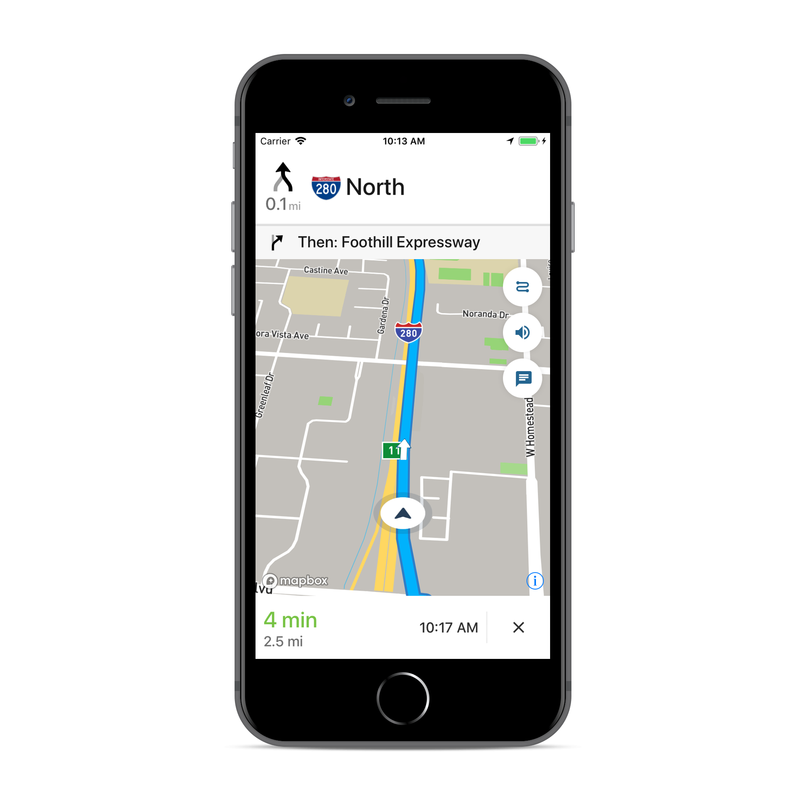

# [Mapbox Navigation SDK for iOS](https://docs.mapbox.com/ios/navigation/)



The Mapbox Navigation SDK gives you all the tools you need to add turn-by-turn navigation to your application. It takes just a few minutes to drop a full-fledged turn-by-turn navigation view controller into your application. Or use the Core Navigation framework directly to build something truly custom.

The Mapbox Navigation SDK and Core Navigation are compatible with applications written in Swift 5 in Xcode 10.2. The Mapbox Navigation and Mapbox Core Navigation frameworks run on iOS 10.0 and above.

## Installation

### Using Swift Package Manager

To install the MapboxNavigation framework in an application using [Swift Package Manager](https://swift.org/package-manager/):

1. Go to your [Mapbox account dashboard](https://account.mapbox.com/) and create an access token that has the `DOWNLOADS:READ` scope. **PLEASE NOTE: This is not the same as your production Mapbox API token. Make sure to keep it private and do not insert it into any Info.plist file.** Create a file named `.netrc` in your home directory if it doesn’t already exist, then add the following lines to the end of the file:
   ```
   machine api.mapbox.com
     login mapbox
     password PRIVATE_MAPBOX_API_TOKEN
   ```
   where _PRIVATE_MAPBOX_API_TOKEN_ is your Mapbox API token with the `DOWNLOADS:READ` scope. 

1. In Xcode, go to File ‣ Swift Packages ‣ Add Package Dependency.

1. Enter `https://github.com/mapbox/mapbox-navigation-ios.git` as the package repository and click Next.

1. Set Rules to Version, Up to Next Major, and enter `${SHORT_VERSION}` as the minimum version requirement. Click Next.

To install the MapboxCoreNavigation framework in another package rather than an application, run `swift package init` to create a Package.swift, then add the following dependency:

```swift
// Latest prerelease
.package(name: "MapboxNavigation", url: "https://github.com/mapbox/mapbox-navigation-ios.git", from: "${SHORT_VERSION}")
```

### Using CocoaPods

To install the MapboxNavigation framework using [CocoaPods](https://cocoapods.org/):

1. Go to your [Mapbox account dashboard](https://account.mapbox.com/) and create an access token that has the `DOWNLOADS:READ` scope. **PLEASE NOTE: This is not the same as your production Mapbox API token. Make sure to keep it private and do not insert it into any Info.plist file.** Create a file named `.netrc` in your home directory if it doesn’t already exist, then add the following lines to the end of the file:
   ```
   machine api.mapbox.com 
     login mapbox
     password PRIVATE_MAPBOX_API_TOKEN
   ```
   where _PRIVATE_MAPBOX_API_TOKEN_ is your Mapbox API token with the `DOWNLOADS:READ` scope. 

1. Create a [Podfile](https://guides.cocoapods.org/syntax/podfile.html) with the following specification:
   ```ruby
   # Latest stable release
   pod 'MapboxNavigation', '~> ${MINOR_VERSION}'
   # Latest prerelease
   pod 'MapboxCoreNavigation', :git => 'https://github.com/mapbox/mapbox-navigation-ios.git', :tag => 'v${SHORT_VERSION}'
   pod 'MapboxNavigation', :git => 'https://github.com/mapbox/mapbox-navigation-ios.git', :tag => 'v${SHORT_VERSION}'
   ```

1. Run `pod repo update && pod install` and open the resulting Xcode workspace.

## Configuration

1. Mapbox APIs and vector tiles require a Mapbox account and API access token. In the project editor, select the application target, then go to the Info tab. Under the “Custom iOS Target Properties” section, set `MBXAccessToken` to your access token. You can obtain an access token from the [Mapbox account page](https://account.mapbox.com/access-tokens/). Usage of Mapbox APIs is [billed](https://www.mapbox.com/pricing/) together based on [monthly active users (MAU)](https://docs.mapbox.com/help/glossary/monthly-active-users/) rather than individually by HTTP request.

1. In order for the SDK to track the user’s location as they move along the route, set `NSLocationWhenInUseUsageDescription` to:
   > Shows your location on the map and helps improve the map.

1. Users expect the SDK to continue to track the user’s location and deliver audible instructions even while a different application is visible or the device is locked. Go to the Signing & Capabilities tab. Under the Background Modes section, enable “Audio, AirPlay, and Picture in Picture” and “Location updates”. (Alternatively, add the `audio` and `location` values to the `UIBackgroundModes` array in the Info tab.)

Now import the relevant modules and present a new `NavigationViewController`. You can also [push to a navigation view controller from within a storyboard](https://docs.mapbox.com/ios/navigation/overview/storyboards/) if your application’s UI is laid out in Interface Builder.

```swift
import MapboxDirections
import MapboxCoreNavigation
import MapboxNavigation
```

```swift
// Define two waypoints to travel between
let origin = Waypoint(coordinate: CLLocationCoordinate2D(latitude: 38.9131752, longitude: -77.0324047), name: "Mapbox")
let destination = Waypoint(coordinate: CLLocationCoordinate2D(latitude: 38.8977, longitude: -77.0365), name: "White House")

// Set options
let routeOptions = NavigationRouteOptions(waypoints: [origin, destination])

// Request a route using MapboxDirections
Directions.shared.calculate(routeOptions) { [weak self] (session, result) in
    switch result {
    case .failure(let error):
        print(error.localizedDescription)
    case .success(let response):
        guard let strongSelf = self else {
            return
        }
        // Pass the generated route response to the the NavigationViewController
        let viewController = NavigationViewController(for: response, routeIndex: 0, routeOptions: routeOptions)
        viewController.modalPresentationStyle = .fullScreen
        strongSelf.present(viewController, animated: true, completion: nil)
    }
}
```

## Starting points

This SDK is divided into two frameworks: the Mapbox Navigation framework (`MapboxNavigation`) is the ready-made turn-by-turn navigation UI, while the Mapbox Core Navigation framework (`MapboxCoreNavigation`) is responsible for the underlying navigation logic.

### Mapbox Navigation

`NavigationViewController` is the main class that encapsulates the entirety of the turn-by-turn navigation UI, orchestrating the map view, various UI elements, and the route controller. Your application would most likely present an instance of this class. The `NavigationViewControllerDelegate` protocol allows your application to customize various aspects of the UI and react to location-related events as they occur.

`NavigationMapView` is the map view at the center of the turn-by-turn navigation UI. You can also use this class independently of `NavigationViewController`, for example to display a route preview map. The `NavigationMapViewDelegate` protocol allows your application to customize various aspects of the map view’s appearance. `PassiveLocationProvider` is an optional alternative to `CLLocationManager` for use with any standalone `MapView` or `NavigationMapView`.

`CarPlayManager` is the class that manages the [CarPlay](https://developer.apple.com/carplay/) screen if your application is CarPlay-enabled. It provides a main map for browsing, a search interface that can be powered by the [Mapbox Search SDK for iOS](https://docs.mapbox.com/ios/search/) or [MapboxGeocoder.swift](https://github.com/mapbox/MapboxGeocoder.swift/), and a turn-by-turn navigation UI similar to the one provided by `NavigationViewController`. Your `UIApplicationDelegate` subclass can conform to the `CarPlayManagerDelegate` protocol to manage handoffs between `NavigationViewController` and the CarPlay device, as well as to customize some aspects of the CarPlay navigation experience. To take advantage of CarPlay functionality, your application must have a CarPlay navigation application entitlement and be built in Xcode 10 or above, and the user’s iPhone or iPad must have iOS 12 or above installed.

### Core Navigation

`MapboxNavigationService` is responsible for receiving user location updates and determining their relation to the route line. If you build a completely custom navigation UI, this is the class your code would interact with directly. The `NavigationServiceDelegate` protocol allows your application to react to location-related events as they occur. Corresponding `Notification`s from the `NavigationService`'s `RouteController` are also posted to the shared `NotificationCenter`. These notifications indicate the current state of the application in the form of a `RouteProgress` object.

For further details, consult the guides and examples included with this API reference. If you have any questions, please see [our help page](https://docs.mapbox.com/help/). We welcome your [bug reports, feature requests, and contributions](https://github.com/mapbox/mapbox-navigation-ios/blob/main/CONTRIBUTING.md).
